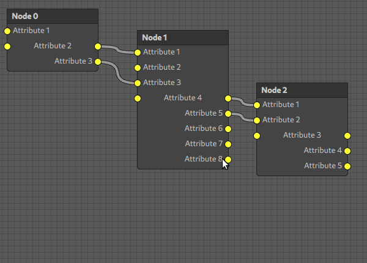

# QML Node Graph

This is a basic QML module for creating node graphs. It may serve you as an inspiration, when you are intending to create your own.

## Features
- A `Node` can have any number of `Attributes`.
- Each `Attribute` can have an input and an output `Socket`.
- The inputs and outputs of each `Attribute` can be linked by a `Link`.
- Multiple `Nodes` can be selected using the `SelectionRect` and moved around or deleted.

## Preview
This is me playing around with the sample:


## Sample
You can try out the sample yourself using [qmlscene](https://doc.qt.io/qt-5/qtquick-qmlscene.html):
```
qmlscene -I . Sample.qml
```

## Dependencies
```
import QtQuick 2.12
import QtQuick.Shapes 1.15
```
